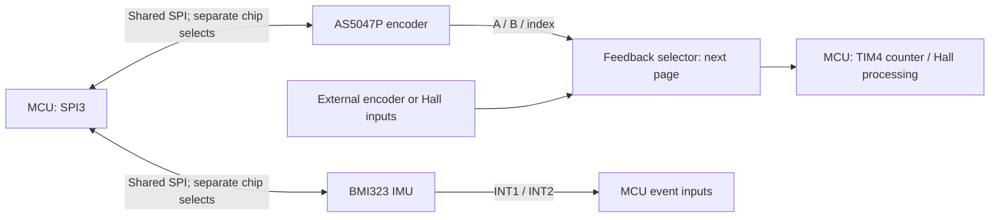

> **Interface update, 2026-09-26:** The shared SPI and feedback selection portions below are historical. See the [implemented sensor interface revision](../sensor_interface_revision/README.md) for the current dedicated SPI3, IMU I2C2, external-input and MCU pin assignments.

# Page 9 — SPI sensors: explanation and decisions

Prepared 26 September 2026 for the manual rebuild. Read alongside [the rendered schematic](schematic.svg).

## My recommendation first

**Keep the present architecture: onboard magnetic encoder + IMU, sharing SPI, with a separate A/B/I route for motor feedback.** I found no pin-connection mismatch in the checks described below. That is a schematic-level conclusion, not proof of working firmware or a quiet PCB.

The most valuable work here is defining startup, angle tracking and fault handling. Adding another SPI peripheral or changing sensor ICs is not presently justified. For component reduction, the extra encoder capacitor is a reasonable candidate; removing the IMU entirely would save much more, but would also remove a useful robotics capability.

**No schematic changes were made.** This document gives you the choices to evaluate.

### Five things to decide after your swim

1. **Keep the IMU?** I recommend yes for this robotics building block. It measures board/body motion; it is not a second measurement of motor-shaft angle.
2. **Keep both IMU interrupt wires?** I recommend keeping them unless a specific GPIO is needed elsewhere. One is likely sufficient for the first firmware.
3. **Remove C602, the extra 1 µF encoder capacitor?** Possible in our externally powered 3.3 V configuration. My preference is to retain it on revision 1 unless placement becomes tight.
4. **Add two weak SPI idle resistors?** I recommend considering 100 kΩ pulldowns on SCK and MOSI to make their reset state explicit. This costs two tiny components, not another IC.
5. **Use periodic encoder diagnostics during operation?** Yes. SPI should become mostly available to the IMU, rather than being permanently abandoned by the encoder driver.

## 1. What this page does

There are two sensors:

- **U601, AS5047P:** measures the angle of the shaft-mounted magnet relative to this board.
- **U701, BMI323:** measures acceleration and angular velocity of the board itself.

They answer different questions. A controller bolted to a stationary motor housing can see the rotor turning through U601 while U701 reports approximately no rotation of the housing. On a moving robot link, U701 reports that link's movement.

The communication paths are:

SPI is a set of command/data wires. The A/B path is a separate stream of movement events. The timer can count those events without waiting for an SPI transaction or making the CPU service every edge.

### Actual connections in the saved project

| Function | Sensor-side connection | MCU-side connection |
|---|---|---|
| Shared clock | U601 pin 2; U701 pin 13 | PB3, U4 pad 54, through R313 |
| Shared MCU-to-sensor data | U601 pin 4; U701 pin 14 | PB5, U4 pad 56, through R314 |
| Shared sensor-to-MCU data | U601 pin 3 through R611; U701 pin 1 through R714 | PB4, U4 pad 55 |
| Encoder select | U601 pin 1 | PA15, U4 pad 51 |
| IMU select | U701 pin 12 | PC4, U4 pad 21 |
| Encoder A / B / index | U601 pins 7 / 6 / 14, through R601–R603 | Selector → PB6 / PB7 / PB8 |
| IMU interrupt 1 / 2 | U701 pins 4 / 9 | PA4 / PA5, U4 pads 17 / 18 |

This table comes from the exported project netlist. PB3/PB4/PB5 support SPI3; PB6/PB7 support TIM4 channels 1/2. PA15 and PC4 should be ordinary GPIO chip selects. PB8 index handling must be explicitly implemented; merely assigning a third timer channel does not establish the desired index-reset behavior. See [ST's pin descriptions](https://www.st.com/resource/en/datasheet/stspin32g4.pdf).

## 2. Encoder: initial angle versus ongoing movement

Think of the absolute reading as **“the shaft is at this angle now.”** Think of quadrature as **“it moved one step clockwise/counterclockwise.”**

At startup, firmware obtains an absolute reference and aligns its movement counter with it. During running, the counter tracks motion. Each FOC update reads the current count and converts it into the angle needed by the control algorithm.

For N counts per mechanical revolution:

`mechanical angle = initial angle + signed_count_change × 360° / N`

Then, for p motor pole pairs:

`electrical angle = wrap(p × mechanical angle + calibrated electrical offset)`

The electrical offset aligns the sensor's coordinate system with the rotor/stator magnetic relationship. Knowing the shaft's angle does not automatically establish that alignment. Calibration must also establish direction and count scale.

### Manufacturer facts that matter to this implementation

The AS5047P provides a 14-bit absolute SPI reading and independent ABI output. Its default ABI scale is 4000 counts/revolution; binary operation can give 4096. It uses SPI mode 1, parity and pipelined read responses. Configuration can be rewritten after each power-up without permanently programming its OTP memory. The TEST pin is grounded; unused U/V/W outputs may remain open. [Encoder datasheet](https://www.infineon.com/assets/row/public/documents/24/49/infineon-as5047p-datasheet-en.pdf)

**Recommendation:** explicitly configure and read back the scale and direction on every boot. Do not rely on a library's assumed default. Keep calibration in MCU flash and avoid irreversible sensor programming for this development board.

For a chosen N = 4096, one count is **0.0879° mechanical**. With an illustrative seven pole pairs, it represents **0.615° electrical**. Half-count rounding alone is about ±0.308° electrical; magnet alignment, sensor error, timing and other effects add to this. Resolution is not the same as accuracy.

At 6000 rpm, that scale produces 409,600 quadrature count events per second. Hardware counting is therefore useful. You do not want 409,600 CPU interrupts per second just to maintain angle.

At low speed, a simple speed estimate from count differences becomes jumpy: some samples see no movement and the next sees one count. Timestamping edges, averaging over a longer interval, or using an observer can improve speed estimation. That is a firmware choice, not automatically a reason to replace the encoder.

### Important startup detail

Reading an absolute angle and later zeroing a counter can lose motion between those operations. For an initially stationary motor, this is straightforward; for a robot joint already moving at power-up, it is not.

Start the counter before correlating it with the absolute reading, record counts around the SPI sample, and account for the sample timing and sensor delay. Validate the mapping with controlled motion. Do not enable torque until position and calibration checks pass.

The index pulse is useful as a once-per-turn reference/check. Avoid blindly resetting the live control angle whenever it arrives: an unexpected count correction could create a torque disturbance. Compare against the expected index position and handle discrepancies deliberately.

## 3. Why sharing SPI works—and the catch

The wires mean:

- **SCK:** clock supplied by the MCU.
- **MOSI:** MCU sends commands/data.
- **MISO:** selected sensor returns data.
- **CS_N:** active-low chip select; choose one sensor at a time.

Both sensors see clock and outgoing data. Only the selected SPI device should respond on the shared return-data wire. The two separate chip selects make this possible.

**The catch is clock mode.** The encoder uses mode 1; the BMI323 supports modes 0 and 3. Use mode 0 for the IMU as a simple starting choice. Both devices permit up to 10 MHz under their stated conditions; that is a ceiling, not a recommended first bring-up speed. [Encoder timing](https://www.infineon.com/assets/row/public/documents/24/49/infineon-as5047p-datasheet-en.pdf), [BMI323 interface specification](https://www.bosch-sensortec.com/media/boschsensortec/downloads/datasheets/bst-bmi323-ds000.PDF)

For each transaction:

1. Finish the previous transfer, including DMA and the final shifted bit.
2. Raise both chip selects and respect the device's required idle/release times.
3. Change SPI mode, clock and framing while both devices are deselected.
4. Lower only the intended chip select, exchange the complete transaction, then raise it.
5. Interpret the response with the correct device protocol and error checks.

Use one bus owner/lock so an IMU callback cannot change SPI configuration halfway through an encoder read. Prefer DMA or short non-blocking transfers; never make the current-control interrupt wait for a long IMU operation.

### How much time would the IMU actually use?

Illustrative burst: 12 bytes of six-axis samples plus one address byte and one dummy byte = **112 clock periods**. This excludes status/timestamp additions and software/idle overhead.

| SPI clock | Time for that burst | Bus occupancy at an illustrative 2 kHz read rate |
|---|---:|---:|
| 2 MHz | 56 µs | 11.2% |
| 5 MHz | 22.4 µs | 4.48% |

A 20 kHz FOC loop has a 50 µs period. The slower burst exceeds one such period, but this is acceptable **if the FOC loop uses the hardware encoder counter and is not blocked by the transfer**. Bus occupancy is not CPU occupancy.

My starting recommendation is **2 MHz for communication bring-up**, then raise it if the measured timing budget requires it. There is no need to immediately chase the interface maximum.

## 4. Every supporting component: why it exists

| Parts | Present value | Purpose and recommendation |
|---|---|---|
| R313, R314 | 22 Ω | Series resistors on MCU-driven SCK/MOSI. Place at the MCU. Keep initially. |
| R611, R714 | 33 Ω | One series resistor at each sensor's MISO output. Keep initially. |
| R601–R603 | 33 Ω | Series resistors on encoder A/B/index. Place at U601. Keep initially. |
| R309 | 10 kΩ | Encoder chip-select pull-up: deselected while MCU is resetting. Keep. |
| R308 | 10 kΩ | IMU chip-select pull-up: establishes a robust idle state. Keep initially. |
| C601 | 100 nF | Local encoder supply bypass. Keep close to supply/ground pins. |
| C602 | 1 µF | Extra local encoder reservoir; possible reduction candidate, explained below. |
| C701, C702 | 100 nF each | Local bypass for IMU VDDIO and VDD. Keep both, one at each supply pin. |
| TP1010–TP1012 | Clock/MOSI/MISO pads | Useful for decoding transactions and checking edges. Keep accessible pads; avoid long trace branches. |

### What the small series resistors really do

A fast edge launches a voltage/current disturbance down a trace. Reflections can make the receiver see overshoot or multiple crossings of its logic threshold. A resistor near the driving pin can reduce that disturbance.

These are **signal-edge damping resistors**, not motor-current limiters. MISO is return *data*; its electrical return current still needs a nearby ground path. The schematic's phrase “local return damping” should not be read as a special ground-return circuit.

The selected 22/33 Ω values are sensible starting values, not values derived from the final PCB trace impedance. Permanent assembly is compatible with them: they can simply remain populated for normal operation.

For scale, an ideal 33 Ω resistor driving an assumed 30 pF load has a time constant of only **0.99 ns**. A small illustrative ngspice check gives a corner of about **161 MHz**; 22 Ω gives **241 MHz**. This helps explain why these resistors need not destroy a several-MHz data stream. **It does not prove signal integrity:** real pin impedance, trace delays, stubs and capacitive loading matter. The example model is saved here separately.

### What the capacitors do—and what can be simplified

The power traces have inductance, so they cannot instantly deliver every short current pulse. A local capacitor supplies some of that charge. In the simplest approximation, `ΔV = I × Δt / C`.

For an **illustrative** 10 mA extra current lasting 100 ns, an ideal 100 nF capacitor drops 10 mV; 1 µF drops 1 mV. These are not measured sensor transients. At very fast edges, mounting inductance and placement limit the benefit of adding capacitance.

U601's two supply pins are deliberately joined to external 3V3. The manufacturer's 3.3 V circuit shows 100 nF; the 1 µF LDO-output requirement applies to its internally regulated supply arrangement. Consequently **our C602 is additional local capacitance, not a mandatory active-LDO stability component**. [Encoder supply diagrams](https://www.infineon.com/assets/row/public/documents/24/49/infineon-as5047p-datasheet-en.pdf)

Removing C602 is a reasonable one-component saving if local supply quality is demonstrated. My revision-1 preference is to retain it. By contrast, the two IMU capacitors serve two separate supply pins; do not merge them merely because both nets are called 3V3. Bosch specifies local 100 nF bypassing at each. [BMI323 connection diagrams](https://www.bosch-sensortec.com/media/boschsensortec/downloads/datasheets/bst-bmi323-ds000.PDF)

A 10 kΩ chip-select pull-up draws only **0.33 mA while selected low**. It is not a meaningful power burden here.

## 5. The IMU: what it adds to a robotics building block

An accelerometer measures specific force, not a clean position signal. A gyroscope measures angular velocity, not an absolute compass heading. Combining them can help estimate orientation, but accelerometer readings during motion contain more than gravity, and integrated gyro bias causes drift.

This makes the IMU useful for link/body motion, vibration logging and experiments with estimation/control. It does not independently provide rotor electrical angle or eliminate the motor encoder.

### Sensor position matters mechanically

If the board is offset from a body's rotation centre, its accelerometer measures rotational acceleration contributions too:

`a_sensor = a_origin + α × r + ω × (ω × r)`

The sensor's specific-force reading also depends on gravity and frame orientation. For example, an offset of 30 mm at 10 rad/s gives a centripetal acceleration magnitude of **3 m/s²**. That is a real effect to model, not electrical noise to remove with more decoupling.

Record the IMU's orientation and position in the robot frame. If the board is stationary while the motor shaft rotates, do not put rotor speed into this rigid-body offset formula—the IMU is attached to the housing.

### Filtering is a control-design choice

Stronger filtering makes the trace look smoother but adds delay. For an illustrative first-order filter, `H(s) = 1/(1 + sτ)` and `τ = 1/(2πfc)`.

With a 100 Hz corner, the phase lag is about **11.3° at 20 Hz** and **26.6° at 50 Hz**. The BMI323's configured internal filters need their actual timing assessed; this simple model explains the tradeoff, not the chip's exact transfer function.

Choose sample rate and filtering from the intended body-control bandwidth and vibration spectrum. Start with a practical logging configuration, then inspect data with the motor off and running. Do not assume the highest available sample rate produces the best control result.

### Interrupts and startup

INT1/INT2 can report events without constant polling; a FIFO buffers samples between reads. The BMI323 supports configurable push-pull/open-drain interrupt outputs and already has a weak CS pull-up. Its startup includes selecting SPI with an initial dummy access, waiting for the interface transition, then checking identification/status. SPI reads include a dummy byte. [BMI323 datasheet, interface and interrupt sections](https://www.bosch-sensortec.com/media/boschsensortec/downloads/datasheets/bst-bmi323-ds000.PDF)

Use push-pull interrupts for the current wiring; open-drain operation would require a pull-up. One event line can likely cover the initial data-ready/FIFO need. Keeping the second costs a GPIO and routing, but no extra IC or passive. **I would keep both unless we have a concrete alternative use for PA5.**

## 6. Firmware behavior I recommend

This is an implementation checklist, not existing tested firmware:

1. Keep motor PWM off; hold the feedback selector disabled.
2. Establish both chip selects high before enabling SPI. Configure defined idle levels and use SWD without assigning the SPI pins to JTAG/SWO. Carry forward the earlier MCU-review requirement to disable unused UCPD dead-battery pull-downs (`PWR_CR3.UCPD1_DBDIS`), since PB4 and PB6 are used here for MISO and feedback.
3. Initialize the IMU's SPI interface before normal shared-bus traffic, respecting its startup timing.
4. Initialize the encoder and wait for valid status. Apply and read back the chosen count scale, direction and output settings.
5. Load motor calibration; reject missing or incompatible calibration rather than assuming an offset of zero.
6. Select onboard feedback, enable the selector with PWM still off, and allow the shared bus-voltage measurement path to settle.
7. Start counting; correlate the absolute angle and count with a procedure that handles any shaft motion. Ignore startup/index transitions until synchronization completes.
8. Check plausible bus voltage, feedback and other motor-start conditions before enabling torque.
9. During running, keep FOC scheduling independent of SPI. Read IMU data and check encoder communication/health at appropriate lower-priority intervals.
10. On invalid/stale position, count mismatch, or loss of sensor communication, apply the defined motor fault response. Recovery must resynchronize before torque resumes.

Do not rely solely on “no encoder pulses” as a fault test: a stationary healthy motor produces no movement pulses either. Use commanded behavior, measured current, sensor status and periodic absolute/count comparisons together. The encoder's diagnostic registers are useful even when ABI is the normal control input. Their required polling/fault-response time is a control-safety design choice, not something established by the schematic.

PB8 remains a BOOT0-capable pin even though you removed the BOOT button. Keep the agreed boot-option configuration and reset isolation/pulldown policy; removing a button does not change the silicon pin function. We can revisit its exact behavior on the selector page.

The next sheet also gates `VBUS_SENSE` with the feedback mux. Enabling/disabling feedback therefore affects more than the encoder. The existing note calls for a **2 ms settling wait**; preserve this dependency in firmware.

## 7. Placement precautions without imposing an empty board centre

These are layout intentions, not findings about the current PCB:

- Keep the encoder at the shaft axis on the bottom side, as agreed. Check magnet alignment, gap and angle error over a full rotation.
- There is no need to reserve a blanket empty top-side centre for magnet clearance. Small components can occupy it where mechanically compatible. Still keep switching inductors, motor/brake current loops and field-distorting hardware away from the sensing region as practicable.
- Keep outgoing and returning high-current paths close together. A tightly coupled pair/loop generally disturbs the sensor less than a widely separated path carrying the same current.
- Mount the IMU on a mechanically stable area, away from mounting-hole strain, board flex and concentrated power-stage heating. Do not add a floppy isolated PCB tab as an assumed cure for vibration.
- Give SPI and ABI traces a continuous nearby ground reference. Avoid routing over gaps or beside phase-switch copper. Keep bus branches short.
- Place each damping resistor at its driver: MCU for SCK/MOSI; sensor for MISO and ABI. A resistor at the wrong end is not equivalent.
- Keep local capacitor loops short. Put signal-layer transition ground vias nearby where useful, rather than separating “sensor ground” with a moat that breaks returns.

## 8. Ranked reconsideration list

**High** means resolve before first powered motor operation; **medium** means worthwhile design/firmware choice; **low** means optional refinement. These are not all hardware defects.

| Priority | Topic | My recommendation | Cost / tradeoff |
|---|---|---|---|
| High | SPI mode and transaction ownership | Per-device configuration, both CS high during changes, one bus owner | Firmware complexity; no extra board area |
| High | Absolute-to-counter alignment | Deliberate startup and recovery synchronization, including already-moving shaft | More firmware/testing; prevents angle jumps |
| High | Encoder health during operation | Retain periodic diagnostics and absolute/count plausibility checks | Small SPI/CPU budget; fault latency must be specified |
| High | Counter scale and electrical calibration | Explicit scale/direction readback and stored electrical offset | Calibration workflow; no additional components |
| High | Motor-control timer allocation | TIM4 for position; keep brake PWM on a separate timer such as the planned TIM17 | Firmware resource constraint, not an extra IC |
| Medium | SCK/MOSI during reset | Consider two 100 kΩ pulldowns; configure idle levels early regardless | Two passives; protects the pre-firmware interval. Current schematic does not explicitly bias these lines |
| Medium | Whether the board needs an IMU | Keep for robotics learning/body-motion capability | Removing U701 saves more area than trimming tiny passives, but loses that feature |
| Medium | IMU sample rate/filtering | Choose for application bandwidth; inspect running-motor data | Lower noise versus more delay; no universal best setting |
| Medium | Magnetic/vibration/heat environment | Test error against current, speed and temperature after layout | Placement space and test effort |
| Low | C602 extra encoder capacitor | Keep first build; reasonable candidate to omit after supply measurements | Saves one capacitor, reduces local charge reserve |
| Low | IMU INT2 | Keep unless PA5 is needed | One trace/GPIO; removal gives no component-area saving |
| Low | R308 external IMU CS pull-up | Keep first build; internal pull-up makes omission plausible on short, quiet routing | Saves one resistor but weakens reset bias |
| Low | SPI test pads / damping resistors | Keep accessible pads and current damping values | Small area cost; helps bring-up and edge quality |

### Choices I would avoid for this revision

- Splitting SPI solely because the IMU is present: the timing example does not justify the extra routing/pins.
- Removing all small resistors to save area before identifying an actual placement bottleneck.
- Adding a separate sensor regulator/ferrite network without evidence of supply noise that needs it.
- Treating ABI as a guarantee that position can never be lost, or treating the IMU as a backup rotor encoder.

## 9. Evidence and limits

**High confidence:** component values, saved net connections and MCU destinations come from a fresh root netlist and the actual sheet. Sensor pin functions, supply arrangements and communication requirements were compared with the manufacturer documents linked above. The sheet rendering was inspected.

**Conditional:** reliable mode switching, startup alignment, timing margins and fault response require firmware and hardware testing. Magnetic accuracy, vibration sensitivity, supply noise and trace quality were not measured.

A sheet-only automated scan flagged cross-sheet signals as disconnected and 3V3 as unpowered. The root netlist resolves them to the MCU, selector and regulator. It also suggested MISO/interrupt pull-ups from generic heuristics; these are not blanket requirements for driven SPI data and configured push-pull interrupts. Passive MPN coverage remains unfinished and was outside this explanation's scope.

The illustrative RC simulation checks only the stated ideal R/C example. No full sensor model, actual PCB signal-integrity, EMC, thermal, fabrication, sourcing or footprint/3D review is implied. The older MCU review mentions a BOOT button that has since been removed; the current saved wiring and reset pulls take precedence.

**Next discussion:** decide the optional simplifications above, then continue to **page 10, Feedback selection**, where the onboard/external selector and its shared bus-voltage channel deserve their own walkthrough.
