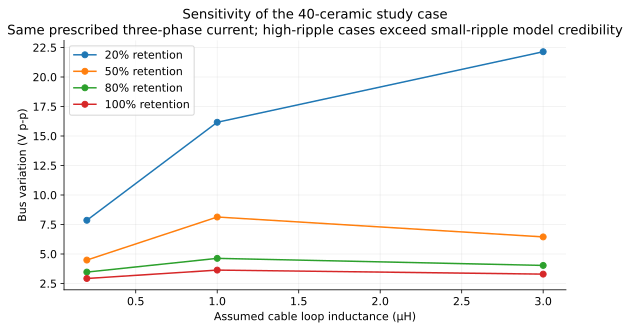

# Worked decision record

Status: educational engineering conclusions, 19 September 2026. The schematic and PCB remain unchanged. These are model-supported directions and conditional examples, not released part selections.

## 1. Onboard capacitor architecture

**Direction:** use distributed onboard ceramics as the next architecture to investigate. Large electrolytic cans are not compulsory. Preserve the option for external bulk capacitance without assuming it must be fitted.

**Evidence:** the published moteus-n1 r1.3 schematic uses 40 × 4.7 µF / 100 V ceramics in its main bank. That establishes feasibility of the architecture, not equivalence to our operating conditions. Our own model compares several candidate banks under identical assumptions.

### Worked three-phase case

36 V source, 40 Arms sinusoidal phase current, 20 kHz SPWM, m=0.8, current lag 30°, electrical frequency 250 Hz, source loop 50 mΩ / 1 µH. Ceramic retention is assumed 50%; parasitics are listed in the model guide.

| Scenario | Effective C, µF | Bus variation, V p-p | Capacitor branch RMS, A | Estimated resistive loss, W |
|---|---:|---:|---|---:|
| Existing bulk + local | 2043.9 | 6.90 | 25.29 / 11.21 | 7.02 |
| 20 ceramics | 47.0 | 16.19 | 33.67 | 2.27 |
| 40 ceramics | 94.0 | 8.13 | 30.52 | 1.40 |
| 80 ceramics | 188.0 | 3.63 | 25.86 | 0.84 |
| 40 ceramics + 1000uF | 1094.0 | 2.22 | 17.69 / 17.87 | 10.05 |

Branch currents in multi-branch rows are ordered: bulk then local for the existing case; ceramic then external bulk for the hybrid. Resistive losses include the assumed common connection resistance. They are not temperature predictions or capacitor ripple-current ratings.

### What to learn from these numbers

- The largest nominal capacitance does not guarantee the smallest switching variation because placement inductance and network resonances matter.
- In the 40-ceramic example, 94 µF effective and assumed source impedance produce about 8.13 V p-p—not the single-leg charge-only estimate. The current waveform and supply model differ.
- The hybrid gives lower voltage variation in this example but substantial estimated resistive heating in its assumed external electrolytic branch. Adding bulk is not a free fix.
- The 20-ceramic case produces large voltage movement. Since phase currents are prescribed and do not respond to bus voltage in this model, its numerical result is best treated as a warning about this assumed case, not a precise physical prediction.
- These results do not prove the existing hardware fails. Its actual parasitics and operating envelope are unknown, and the PCB is not routed. They demonstrate which quantities should be measured and why nominal µF alone is insufficient.

### A conditional design choice you can defend

For **this teaching case only**, choose an illustrative objective of at most 4 V p-p bus variation. The 80-part ceramic case gives about 3.63 V p-p and is a candidate under these assumptions. Its nameplate capacitance is 376 µF; effective capacitance is assumed 188 µF. The 4 V budget is an educational choice, not an approved board specification. This does not yet include a validated margin at 42 V or the full current/modulation envelope.

A first pulse-budget calculation is separate: to keep a 20 A, D=0.5, 20 kHz single-leg case below 1 V charge ripple requires 250 µF effective. At 4.7 µF per part, assumed 50% bias retention and a further 10% tolerance allowance, `ceil(250/(4.7×0.5×0.9)) = 119` parts. This deliberately different result shows why a current waveform and an agreed voltage budget must be stated before announcing a capacitor count.

**Final board count remains open.** Choose it after obtaining the actual capacitor bias/ESR data, a defined source/wiring envelope, modulation and current envelope, and the permissible bus variation. Use the learning model to narrow candidates, then validate with hardware measurements. No parts-availability search is needed to understand these tradeoffs.

## 2. Local bypass placement

**Decision:** put useful capacitance close to each half bridge and minimise its complete outgoing/return loop. Use bottom-side parts where a paired via path is genuinely shorter.

**Reason:** 40 A changing in 80 ns gives 1.5 V across 3 nH but 15 V across 30 nH. Increasing C does not remove that shared connection term. These are scale estimates, not complete overshoot predictions.

Preserve the different return nodes of the 1 µF VM–GND capacitors and the 10 nF VM–MOSFET-source bypasses. Place new banks around the three cells rather than collecting them remotely for visual symmetry alone.

## 3. Braking and connection method

**Decision:** retain a defined path for braking energy and treat battery connection as a separate transient design problem.

The 2,040 µF bank has 0.359 J additional storage between 42 and 46 V; the 94 µF example has 0.0165 J. Neither absorbs a typical multi-joule stop by itself. The brake resistor/supply must handle the remaining energy. Smaller C also gives the overvoltage controls less time to react.

Do not interpret the model's unclamped connection peak as an actual allowed stress. Select and model a connection/precharge strategy before final power-stage validation. The current hardware does not claim onboard precharge.

## 4. Sensing and control

**Decision:** retain dedicated Kelvin sensing, start with the actual DNP state, and choose filtering together with sampling/actuation timing.

At 40 A, 0.1 mΩ of unwanted shared copper adds an 8 A equivalent error. A 100 µs first-order filter adds about 51.5° lag at 2 kHz, compared with 7.2° for 10 µs; 25 µs extra delay adds 18° more. These effects materially change measurement and control quality.

The actual bus filter is about 596 Hz, derived from the divider's Thevenin resistance plus R106. It must not be reused as the phase-current-loop filter model. Optional C414/C424/C434 are unfitted, and fitting them changes high-frequency path matching.

## 5. Placement revision still pending

The learning package annotates existing P0 coordinates. It does not implement P1: mounting holes on PCB, reclaiming top-centre space, parallel/closer phase outputs and MOSFETs, or a new ceramic bank. Those remain hardware tasks. Four mounting symbols already exist in the P1 schematic.

## What measurements resolve the assumptions?

| Measurement | Which uncertainty it resolves |
|---|---|
| Effective capacitor C and impedance versus bias/frequency, from selected part data | Whether nameplate count supplies the assumed C/ESR |
| Source loop impedance / measured bus response with intended leads | Where resonance sits and how strongly it is damped |
| Bus voltage close to each half bridge, with an appropriate short-loop probe | Actual local switching stress and spatial differences |
| Capacitor branch current or validated loss estimate, plus temperature | Current sharing and thermal suitability |
| Gate/source and drain/source switching waveforms | Gate resistor tuning and local inductance |
| ADC reading versus an independent current measurement across PWM duty | Offset, gain, switching artifacts and valid sampling windows |
| Brake response to a controlled known energy return | Threshold timing, bus rise and resistor energy margin |

Begin hardware checks at limited energy/current with suitable instruments. This is a learning validation sequence, not a detailed commissioning procedure.
