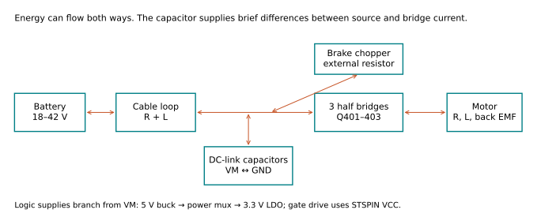
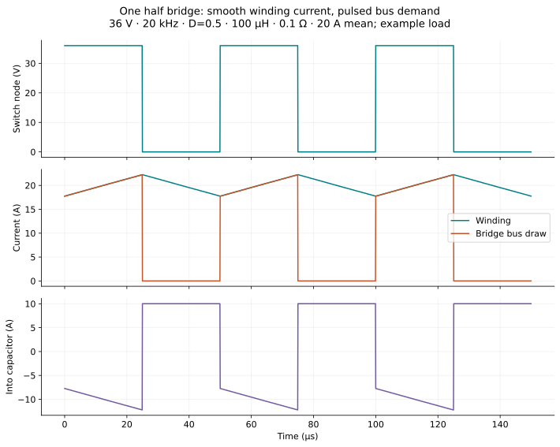
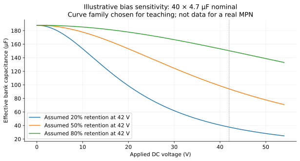
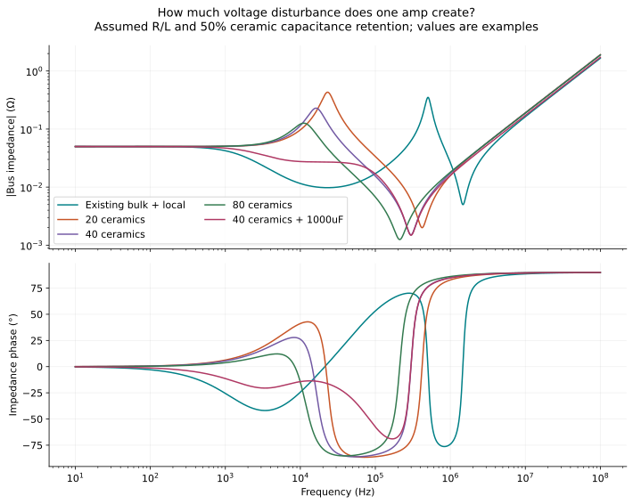
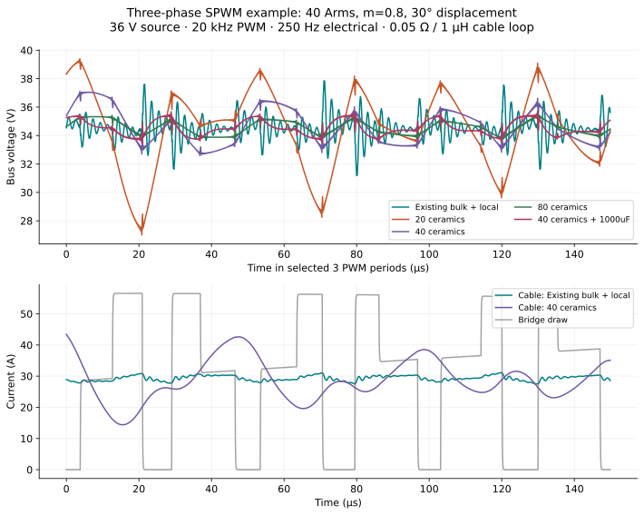
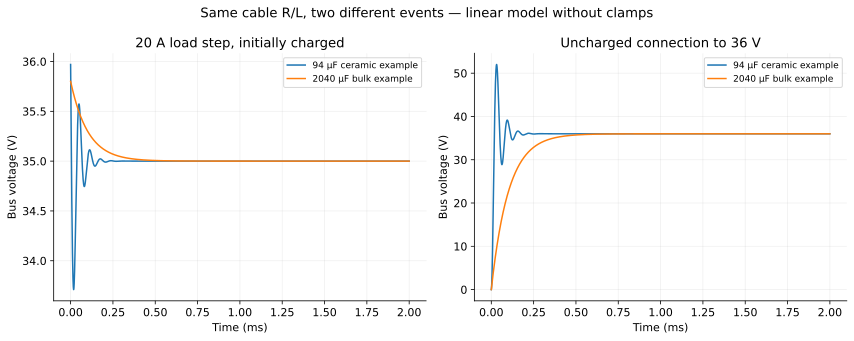
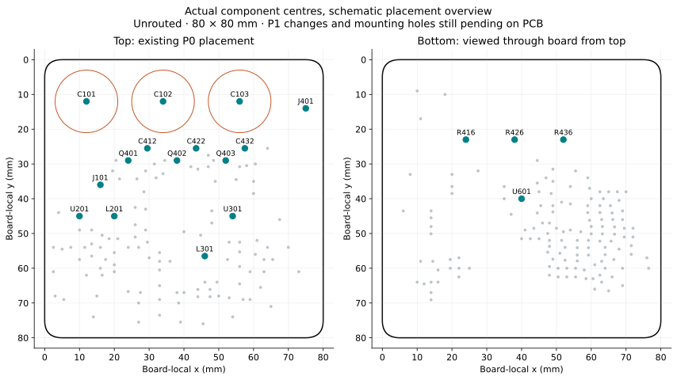
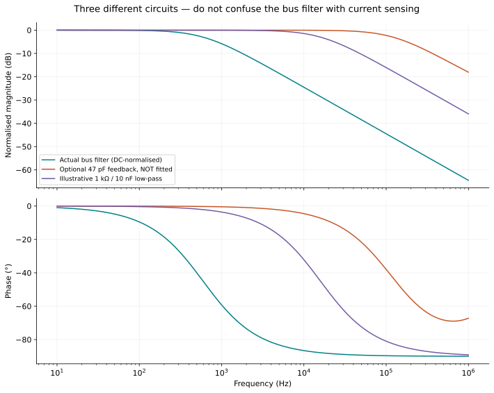
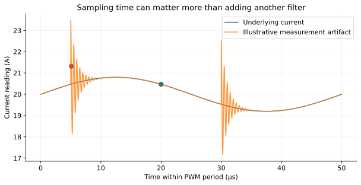

# Learn the ShiroFOC board through models

Keep [the interactive lab](../index.html) open beside this notebook. Each section asks a question, develops a model, and connects the answer to our board. A complete list of assumptions is in [Board inputs](BOARD_INPUTS.md).

## 1. Begin with energy, rather than component names

**Question:** where does electrical energy go when a motor controller runs?

It arrives from the battery through two wires, passes through selected MOSFETs, and reaches the motor windings. Some becomes mechanical work. Some becomes heat in winding resistance, MOSFETs, shunts, connectors and wires. Some temporarily sits in magnetic and electric fields.

The battery sets an approximate voltage. It does not force a fixed current into the motor. Voltage across winding inductance changes current, and current creates torque. Our current controller uses PWM to choose an average applied voltage that produces the requested current.

During braking, mechanical energy can travel back through the inverter onto the DC bus. A battery that accepts charging, another load, or the brake resistor must ultimately absorb it. Capacitors buffer differences in timing; they are not an unlimited energy sink.

### The mechanical analogy

For the force–voltage analogy:

| Electrical quantity | Mechanical analogue | Relationship |
|---|---|---|
| Voltage, V | Force | The quantity driving the flow |
| Current, A | Velocity | The flow variable |
| Charge, C | Displacement | Integral of the flow variable |
| Resistance, Ω | Viscous damping | `V = R I` |
| Inductance, H | Mass | `V = L dI/dt` |
| Capacitance, F | Compliance, inverse stiffness | `V = Q/C` |

Electrical power `VI` parallels mechanical power `Fv`. Inductor energy is `½LI²`, resembling kinetic energy. Capacitor energy is `½CV²`, resembling elastic energy when written in terms of the appropriate force/displacement variables. The analogy helps with dynamics; circuit series/parallel constraints still need to be drawn explicitly.

**Board consequence:** we should follow complete current loops, including their return paths. A wire labelled GND can still develop voltage when current flows through its resistance and inductance.

## 2. The three relationships that explain most of the board

### Resistance: voltage drop and heat

`V = IR`, and `P = I²R`.

At 40 A, our 0.5 mΩ shunt develops 20 mV. With 40 A RMS through that resistor, it dissipates 0.8 W. Doubling current makes four times the heat, not twice. For a low-side shunt in a switching inverter, actual heating depends on when it conducts; using full phase RMS through it is a conservative simple estimate, not an exact conduction-duty model.

### Capacitance: charge and voltage change

`I = C dV/dt`, hence `ΔV = (1/C) ∫ I dt` for constant C.

If a capacitor alone supplies 20 A for 5 µs, the missing charge is 100 µC. A 100 µF capacitor loses 1 V. A 1,000 µF capacitor loses 0.1 V. The result depends on **how much current is missing and for how long**.

### Inductance: fast current changes create voltage

`V = L dI/dt`.

A 10 nH connection carrying a 40 A change in 80 ns develops 5 V. The number is not a full overshoot prediction: other circuit elements affect the waveform. But it explains why centimetres of connection can matter at a switching edge.

**Predict:** adding more capacitance fixes which of these three effects? It directly reduces the charge-related voltage slope. It may also reduce bank ESR/ESL if added in parallel with good routing. It does not automatically remove a shared inductive bottleneck.

## 3. Why motor current and battery current look different

Open **Switching** in the lab.

We begin with one ideal half bridge driving a resistance, inductance and back-EMF source. This is a buck-equivalent teaching circuit with a fixed return. A real three-phase motor has a floating neutral; the other half bridges complete its winding-current paths.

The equation is:

`L di/dt = qVbus − Ri − E`, where `q` is 1 or 0.

When the upper switch is on, the bus supplies the winding current. When the lower switch is on, positive winding current continues circulating even though the upper bus connection is off. Current in an inductor cannot vanish instantly.

The lab maintains the chosen mean current by setting the example back EMF to `E = DVbus − RĪ`. Therefore changing duty also changes the operating point. It is not simulating a motor accelerating to a new speed.

At 36 V, 50% duty, 20 kHz, 100 µH and a 20 A mean winding current, the winding variation is about 4.50 A peak-to-peak. Ignoring the small current variation, the bridge takes approximately 20 A for half a cycle and 0 A for the other half. Average bus current is roughly 10 A. The capacitor supplies approximately 10 A during ON and receives approximately 10 A during OFF if source current stays nearly constant.

### What “ripple” actually means

Ripple simply means a repeated variation around an average. Voltage ripple might be a bus moving between 35.5 and 36.5 V. Capacitor ripple current is the repeated charging and discharging current, even when its average over a cycle is zero.

RMS current is `sqrt(mean(i²))`. It tells you the heating effect in a resistance. A waveform alternating between +10 A and −10 A has zero average but 10 A RMS. It still heats the capacitor's internal resistance.

For the constant-winding-current approximation:

`Icap,rms = I × sqrt(D(1−D))`.

At 20 A and D=0.5, that is 10 A RMS. Doubling C need not reduce that required bank current when the capacitor still supplies the same pulses. It reduces voltage movement; more parallel parts may divide the current among more capacitors.

**Try:** double frequency, then double inductance. Both reduce winding ripple approximately inversely in this operating regime. Increasing frequency also adds switching events per second; we will account for their cost later.

### Extending to all three phases

For ideal switches:

`Ibus = qa ia + qb ib + qc ic`.

Balanced phase currents sum to zero. In a zero switching state—all upper switches on or all lower switches on—the ideal DC-link current is zero even though winding current can circulate. Active states draw or return current. You cannot simply multiply the single-leg RMS formula by three.

The supplied three-phase simulation constructs those switching states and sinusoidal currents over a full electrical cycle. It uses ordinary sinusoidal PWM, not space-vector modulation. A different modulation scheme can change capacitor current and measurement windows.

## 4. Calculate a first capacitor value

**Question:** what does changing from 100 µF to 200 µF buy us?

For the simple single-leg example with constant winding current and constant average source current, during ON the capacitor supplies `(1−D)I` for `DT`. Therefore:

`ΔVcap,pp = I D(1−D) / (fPWM C)`.

At 20 A, 50% duty and 20 kHz:

| Effective capacitance | Charge-related voltage variation |
|---|---:|
| 50 µF | 5.0 V p-p |
| 100 µF | 2.5 V p-p |
| 200 µF | 1.25 V p-p |
| 500 µF | 0.50 V p-p |

This is a first estimate under stated assumptions. It is not the final three-phase design requirement. In particular, cable current is not exactly constant when the supply network resonates near PWM frequencies.

### Real capacitors also contain resistance

Equivalent series resistance, **ESR**, represents electrical loss inside the capacitor over a specified frequency range. Model it as a resistor in series with an ideal capacitor:

`Vterminal = Vcapacitor + RESR Icap`.

A 20 A change in capacitor current through 2 mΩ makes an immediate 40 mV step. Average heating is approximately `Icap,rms² RESR`. At 10 A RMS and 2 mΩ that is 0.2 W.

Actual ESR varies with frequency and temperature. A single ESR is a useful teaching approximation. Do not translate 0.2 W into a temperature rise without a thermal model or measurement.

### Parallel parts

For N identical parts with equal connections:

- Capacitance adds: `Cbank = N Cpart`.
- ESR falls: `Rbank ≈ Rpart/N`.
- Internal ESL falls approximately as `Lpart/N`.
- A shared connection's resistance or inductance does **not** divide by N.

If one end of the bank is connected by a long narrow neck, that neck can dominate the whole bank. Unequal placement also means current will not split perfectly equally.

### Ceramic nameplate values versus effective capacitance

Many high-capacitance ceramics lose capacitance under a DC voltage. “4.7 µF, 100 V” means a nominal capacitance and voltage rating; it does not guarantee 4.7 µF at every voltage below 100 V. The exact curve depends on the part. [Murata explanation](https://www.murata.com/en-sg/support/faqs/capacitor/ceramiccapacitor/char/0005).

The lab uses an adjustable retention fraction. At an assumed 50%, forty 4.7 µF capacitors give **94 µF effective**, not 188 µF. This is a sensitivity example, not a claim about the Murata part used by moteus. The voltage-retention figure deliberately shows hypothetical curves rather than inventing a manufacturer curve.

For small bus ripple, using capacitance evaluated at the operating voltage is sensible. Large startup or energy excursions need voltage-dependent charge/energy integrals if capacitance changes substantially. Our simple connection model holds C constant and illustrates the mechanism.

## 5. The bus as an impedance and transfer-function problem

Open **Capacitors**. Impedance is the ratio between sinusoidal voltage and current at a frequency. Think of it as frequency-dependent resistance with phase.

- `ZR = R`
- `ZL = sL`
- `ZC = 1/(sC)`
- Real capacitor branch: `Zcap = RESR + sLESL + 1/(sC)`

At low frequency, a fixed-amplitude voltage changes slowly and produces little capacitor current, so the voltage/current ratio is high. Increasing frequency lowers its capacitive impedance. At sufficiently high frequency the series inductance takes over and impedance rises again. The impedance minimum is near `1/(2π sqrt(LC))`.

For a stiff ideal voltage source reached through cable impedance `Zs`, the impedance seen by a disturbance current at the board is:

`Zbus = Zs || Zcap1 || Zcap2 ...`

and `ΔVbus = −Zbus ΔIload` when the source voltage itself is not changing.

If bus impedance is 0.1 Ω at a disturbance frequency, a 5 A sinusoidal disturbance at that frequency makes 0.5 V of sinusoidal voltage amplitude. Specify consistently whether amplitudes are peak or RMS; do not multiply peak by RMS.

### Resonance and damping

For cable R and L feeding an ideal C, the source-voltage transfer is:

`Vbus/Vsource = 1 / (LCs² + RCs + 1)`.

This is the familiar second-order denominator. `ωn = 1/sqrt(LC)` and `ζ = (R/2)sqrt(C/L)`. Including capacitor ESR changes both numerator and denominator; the exact formula is in [Model guide](MODEL_GUIDE.md).

Very low resistance reduces heating but also reduces damping. This does not make ceramics bad. It means the source, cable, capacitor and switching load must be considered together. A damped capacitor branch or controlled connection can solve different problems without inserting a large resistor into the motor's continuous power path.

**Predict:** double C. The capacitor becomes more effective over much of the frequency range, but the resonance also moves down by sqrt(2). If it moves toward a strong PWM harmonic, one particular operating case may get worse before it gets better.

### Our comparison

The model drives five networks with the same calculated three-phase bus-current waveform. It includes a 50 mΩ / 1 µH supply loop and assumed capacitor ESR/ESL. The selected phase current is 40 Arms; the mean bus current is about 29.4 A for this operating point. Mean bus voltage is lower than source voltage because the assumed cable resistance drops about 1.47 V.

The results are in [Decision record](DECISION_RECORD.md). Do not read the largest-capacitance arrangement as automatically the best result, or an assumed ESR as a manufacturer's rating. The existing design's local 7.81 µF nameplate represents the DC-link and bridge bypasses only; the model intentionally excludes the auxiliary converter input branches and package bypasses on the other side of each shunt.

## 6. Load changes and connecting the battery

Open **Supply & energy**.

### A sudden increase in demand

Suppose the board was sitting at 36 V and demand suddenly rises by 20 A. The cable current initially cannot jump. The capacitor supplies the difference. Cable current then rises, while the capacitor voltage and inductive current may oscillate before settling.

The final voltage is not necessarily 36 V. A 20 A load through 50 mΩ gives a 1 V steady drop, so the bus settles to 35 V. A capacitor does not fix a continuous resistive drop.

### An initially uncharged board

Connecting an uncharged capacitor changes the initial conditions. The source can launch an oscillatory charging transient. A lightly damped ideal LC network driven by a voltage step approaches a first peak of twice the applied voltage. Real source resistance, clamps and switching alter the result, but the mechanism is real.

The lab excludes precharge and protection action on purpose so you can see the underlying plant. A precharge path initially limits charging current, then is bypassed. It is not the same as permanently adding a power-wasting resistor in series with the motor.

For our board, the connection method remains a system decision. Moteus likewise documents controlled power-up and anti-spark/precharge options. Its ceramic bank does not eliminate the need to consider the power connection. [Moteus electrical setup](https://mjbots.github.io/moteus/guides/electrical-setup/).

## 7. Why braking does not reduce to a capacitor count

You already know the mechanical side: `Ekinetic = ½Jω²`, plus any gravitational or externally supplied energy during the stop.

For a constant capacitor, the additional energy it can store between two voltages is:

`ΔE = ½C(Vmax² − Vstart²)`.

The existing 2,040 µF bank stores 1.799 J in total at 42 V. But the useful additional capacity between 42 and 46 V is only **0.359 J**. A 94 µF bank stores just **0.0165 J** in that same voltage window.

To absorb 10 J between 42 and 46 V using capacitance alone would require about **56,818 µF**. At a constant 100 W arriving on the bus, a 94 µF bank crosses that window in roughly 0.165 ms if nothing else takes energy. The 46 V ceiling is an example, not a qualified allowable voltage for this board.

The brake circuit sends energy to an external resistor. At 46 V and 10 Ω, instantaneous resistor power is 211.6 W when fully switched on. PWM controls the average. Energy per stop and average repetition rate are separate requirements: a resistor may survive a short high-power pulse yet overheat during repeated stops.

**Board consequence:** reducing bulk capacitance can shorten the time available for overvoltage control to react. Keep the intended firmware threshold near 43 V and the hardware backup behaviour in the model when choosing a final bank. Hardware nominal trip around 45.92 V has tolerances and delay; it is not an ideal 45.92 V clamp.

## 8. Turn the mathematics into placement

Open **Placement** and compare the actual component centres.

This is a view of the existing unrouted P0 placement. Bottom positions are shown looking through the board from the top, so top and bottom coordinates correspond. It is not a mirror-view assembly drawing or a routing proposal. P1 mounting holes exist in the schematic but are not on this PCB snapshot.

### Local power loop

Keep the loop involving local capacitance, the half bridge and its return compact. Its current changes rapidly. Wide copper reduces resistance, but short outgoing/return paths close to one another reduce loop inductance. Both are needed.

C412/C422/C432 are each 1 µF from VM to GND. C415/C425/C435 are each 10 nF from VM to the respective MOSFET source **above** its shunt. They serve related high-frequency purposes but do not have the same return node. Combining them into one generic “ground capacitor” would hide an important circuit detail.

New ceramic banks should be spread near the three cells while retaining good shared VM/GND distribution. The bank model collapses all branches to one bus node, so it cannot prove the optimum number of capacitors per cell.

### Why bottom-side decoupling can work

The capacitor does not care which side is aesthetically convenient. It cares about loop impedance. A capacitor directly beneath a supply pin, with a nearby supply via and ground return via, may have a shorter loop than one on top reached through a long trace. A single distant shared via can negate the advantage.

Our four-layer intent is 2 oz outer copper with 0.5 oz inner planes. Continuous ground reference helps signal returns. It does not automatically make a long power-current path low inductance, nor does it make a thin inner plane a substitute for deliberate high-current distribution.

### MCU decoupling: quantify the usual value

An illustrative 50 mA demand for 20 ns removes 1 nC. A 100 nF ideal capacitor drops 10 mV. A 1 µF capacitor drops 1 mV. But a 5 nH connection with a 50 mA change in 2 ns develops 125 mV. This explains why “use 100 nF nearby” is partly about accessible charge and partly about the connection.

The actual MCU current spectrum includes package and on-die behaviour that this pulse example does not model. For U301, preserve the intended capacitors on 3V3, VDDA, VREF+ and VCC. These are different electrical domains; their capacitors cannot all be pooled into one remote bank.

### Kelvin connections: remove the wrong voltage from the measurement

The 0.5 mΩ shunt gives 20 mV at 40 A. A shared 0.1 mΩ copper path adds 4 mV at the same current. If the amplifier includes both drops, it reports 48 A instead of 40 A: a 20% error from a tiny extra resistance.

Dedicated sense terminals and separate thin measurement traces exclude the force-current drop. Route the two sense traces as a close pair. Their job is to carry almost no current, not to help the power path. Keep them away from phase switching copper and gate loops.

### Gates: slower can be quieter, but it costs energy

Our initial high-side gate resistor is 4.7 Ω, with 0 Ω fitted on the low side. These are starting values, not proof of optimal switching.

A rough plateau model is `Igate ≈ (Vdrive − Vplateau)/Rtotal` and `tedge ≈ Qgd/Igate`. More resistance generally reduces gate current and slows voltage transitions. A slower transition reduces some excitation of parasitic inductances/capacitances, but increases the time during which the MOSFET simultaneously has substantial current and voltage.

An overlap-loss estimate per hard-switched MOSFET is `P ≈ ½VI(tr+tf)fPWM`. It excludes output-capacitance energy, diode recovery, deadtime conduction and other losses. The lab uses explicitly assumed gate charge, plateau and driver resistance, not a fitted device model.

Put the resistor near the gate so it acts on the local gate loop. Its return path matters too. Do not solve ringing by adding a resistor value before checking loop geometry and measuring the waveform.

### Bootstrap: another charge-budget example

The 100 nF bootstrap capacitor supplies the high-side gate while its source moves up with the phase. Using the existing conservative 56 nC charge allowance, `ΔV = Q/C = 0.56 V`, before leakage and effective-capacitance corrections. It needs periodic recharging when the phase is low. That is why a static 100% high-side command is not supported by this bootstrap arrangement.

## 9. Follow the current measurement into the ADC

Open **Sensing**.

Our ideal transfer is `Vout = 1.65 + 28 × (Vsense+ − Vsense−)`. With a 0.5 mΩ shunt, that is `1.65 + 0.014 I` volts.

| Current | Ideal output |
|---|---:|
| −80 A | 0.53 V |
| 0 A | 1.65 V |
| +40 A | 2.21 V |
| +80 A | 2.77 V |

The offset permits negative currents on a unipolar ADC. The mathematical 0–3.3 V range corresponds to roughly ±118 A, but real amplifier swing, input common-mode limits and tolerances reduce usable range. This is not an allowed current rating.

A 12-bit ADC over 3.3 V has a nominal step of 0.806 mV, corresponding to approximately 0.0575 A per count here. That is resolution, not accuracy. Offset, gain error, noise, reference variation and sampling error can be much larger.

### The bus-voltage filter is a different circuit

R103 + R104 total 540 kΩ above R105 = 27 kΩ. The divider ratio is 1/21, so 42 V becomes 2.00 V. To find the filter time constant, replace the source with its small-signal resistance:

`Rthevenin = 540 kΩ || 27 kΩ = 25.714 kΩ`.

Add R106 = 1 kΩ, then multiply by C108 = 10 nF:

`τ ≈ 267 µs`, `fc ≈ 596 Hz`.

Using only 1 kΩ × 10 nF would give the wrong filter because it ignores the divider's output resistance. Mux resistance and ADC loading are omitted from this first calculation.

At 20 kHz this ideal filter attenuates a small bus-voltage disturbance by about 30.5 dB relative to its DC divider gain. It is useful for bus monitoring, but too slow to be treated as a fast phase-current filter. The separate hardware brake comparator and driver protection paths have different jobs.

### Do we already have a current low-pass filter?

The optional 47 pF capacitors across the 28 kΩ feedback resistors are **DNP**—not fitted. The actual response depends on the op-amp and ADC configuration as well as the resistor network. We must not present an arbitrary 1 kΩ/10 nF low-pass as if it were installed.

The lab includes a hypothetical RC low-pass so you can explore the tradeoff. It also shows the ideal response of the optional feedback capacitor with the negative sense input held fixed. That response tends toward a finite high-frequency gain rather than zero. The capacitor also breaks high-frequency matching between the two input paths, so common-mode rejection needs analysis before fitting it.

## 10. Filters and sampling spend your control-loop phase budget

For `H(s)=1/(1+sτ)`, magnitude is `1/sqrt(1+(ωτ)²)` and phase is `−atan(ωτ)`.

At 2 kHz:

- τ = 10 µs adds about 7.2° lag.
- τ = 100 µs adds about 51.5° lag.
- A pure 25 µs delay adds another 18° lag.

The larger filter may give a cleaner trace while making the closed-loop current controller much harder to stabilise. These are added lags, not the entire system's phase margin. Include the winding plant, current controller, sampling/hold behaviour and actual actuation delay before making a stability claim.

### Sampling at the right time

The figure deliberately uses an invented ringing waveform to isolate the lesson. Sampling immediately after a switch edge can capture an artifact rather than winding current. Waiting for settling can improve measurement without adding as much continuous filter delay.

For three low-side shunts, the relevant lower switches also need to be conducting for their shunts to observe phase current. At some duties, the usable window is narrow. Timer-triggered ADC sampling, deadtime, amplifier settling and ADC acquisition duration have to fit within valid windows. “Sample in the middle” is incomplete unless we specify the switching state and PWM convention.

The ADC contains a sampling capacitor. A high source impedance takes longer to charge it accurately. Filter resistance, amplifier drive and ADC acquisition time therefore interact. ST's [ADC guidance](https://www.st.com/resource/en/application_note/an5346-stm32g4-adc-use-tips-and-recommendations-stmicroelectronics.pdf) is the relevant reference for turning this into firmware timing.

## 11. Connect the remaining board blocks

The focused models above cover the power/current-sensing decisions. The other subsections follow related reasoning:

| Board block | Why it exists | Useful first model / decision |
|---|---|---|
| 5 V buck, U201 | Efficiently steps battery voltage down | Ideal duty ≈ Vout/Vin; inductor ripple ≈ `(Vin−Vout)D/(Lf)`. Use actual converter frequency/control and effective output C before stability conclusions. |
| 3.3 V LDO, U204 | Supplies MCU and interfaces | Heat ≈ `(Vin−3.3)I`; at 5.25 V and 250 mA, 0.488 W. Thermal-pad placement matters. |
| Power mux, U203 | Selects service/battery-derived logic supply | Trace source transitions, reverse-current blocking and output hold-up. Supply capacitance supports a transition only for a finite time. |
| STSPIN VCC converter | Supplies gate drive | Starts at 8 V; intended firmware selection is 10 V. Gate-charge demand scales with switching frequency. |
| Gate bootstrap | Drives an upper switch above its moving source | Charge budget Q/C and refresh interval, rather than a generic ground-referenced decoupler. |
| Brake comparator and chopper | Provides a path for returned energy | Threshold + delay + resistor energy capacity; separate from normal bus ADC filtering. |
| AS5047P encoder | Rotor position | ABI counting supports runtime angle tracking; SPI config/debug does not require continuous bus occupation. Verify actual firmware strategy. |
| IMU / shared SPI | Motion feedback | Scheduled transactions with separate chip selects. Track signal-return continuity and avoid long branches. |
| CAN transceiver | External differential communication | Termination belongs to bus ends; protection placement follows the connector current path. |
| USB–UART | Service communication | Protect at the connector, preserve USB pair geometry, and account for service-source current limits. |
| SWD, reset, boot | Reliable bring-up and recovery | Avoid unwanted boot/reset levels; keep test access and reference voltage unambiguous. |

These are a map for reading the full schematic, not completed dynamic models of every IC. The weekend's quantitative models concentrate on the decisions in the agreed plan. Manufacturer-specific regulator loop stability, detailed MOSFET switching and full FOC firmware remain separate work.

## 12. Write the decision in your own words

Use [the decision record](DECISION_RECORD.md) as a worked example, then write your own:

> At this bus voltage, PWM frequency and current envelope, I expect this current waveform. This capacitor bank gives this effective capacitance and impedance under these assumptions. I place it here to limit this loop inductance. These two measurements would most change my conclusion.

If you can connect that statement to one time plot, one impedance plot and a current-loop sketch, you have moved beyond selecting default values.
